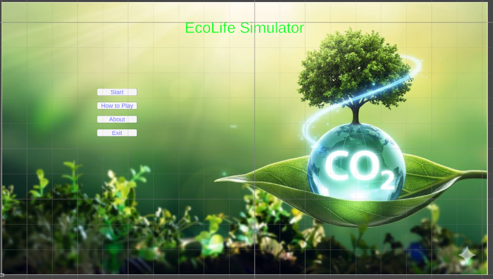
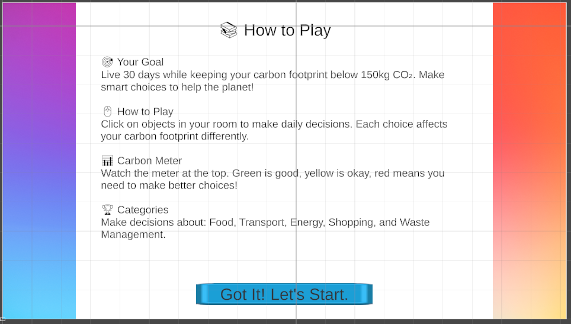
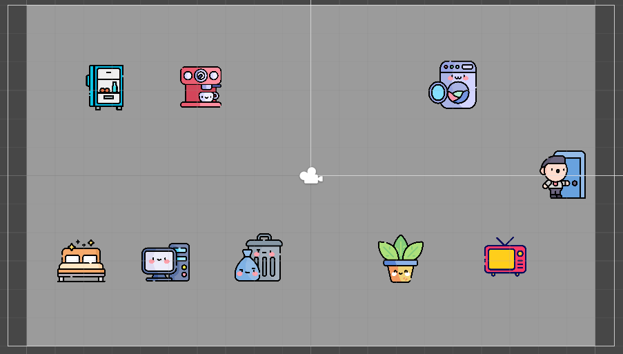
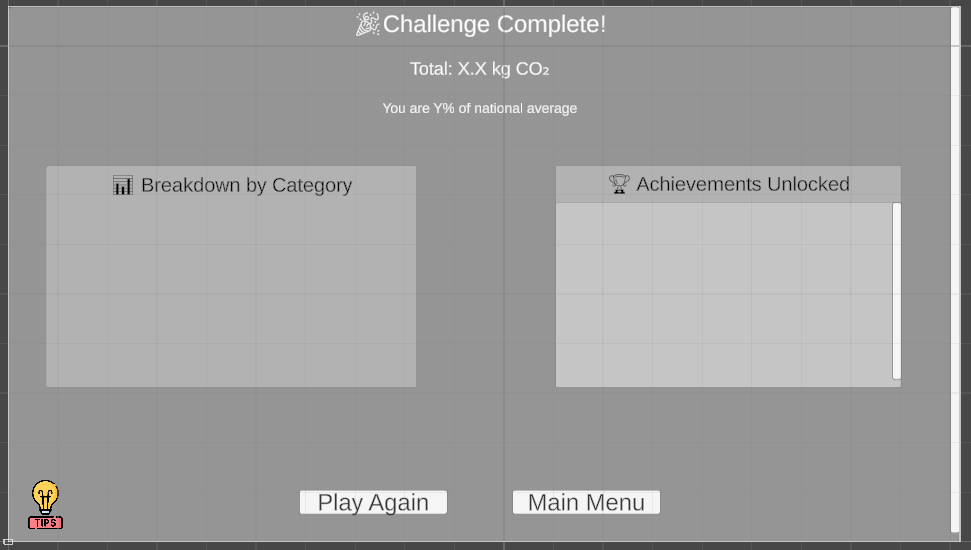

This game was created as a university graduation project. It took two weeks to develop but was rejected because it was designed for computers, but the professor wanted a mobile version instead.

# 🌍 EcoLife Simulator

**EcoLife Simulator** is an educational simulation game that encourages players to make environmentally friendly daily-life decisions.  
Players must manage their lifestyle choices over **30 days** while keeping their **carbon footprint (CO₂ emissions)** as low as possible.

The game aims to raise awareness about sustainability, climate change, and the impact of everyday actions on the environment.

---

## 🎮 Game Overview

In EcoLife Simulator, players interact with objects in a virtual room to make daily decisions related to:

- 🍽️ Food
- 🚗 Transportation
- ⚡ Energy usage
- 🛍️ Shopping
- 🗑️ Waste management

Each decision affects the player’s **carbon footprint**, which is tracked in real time using a color-coded carbon meter.

---

## 🧩 Core Gameplay Loop

1. **Click on objects** (e.g., fridge, computer, door) to interact.
2. **Make choices** from decision pop-ups.
3. Each choice adds or subtracts carbon emissions.
4. After 4 choices, the day ends and a **daily summary** appears.
5. Continue for 30 days and see the **final report** with category breakdowns and achievements.

---

## 🗺️ Scenes

| Scene Name | Purpose |
|-------------|----------|
| **MainMenu** | Start screen (Start, How to Play, Credits) |
| **Tutorial** | Basic game instructions |
| **GamePlay** | Main daily loop with clickable room objects |
| **DaySummary** | Shows results after each day |
| **Results** | Displays total carbon, tips, and achievements |

---

## ⚙️ Core Systems (C# Scripts)

| Script | Description |
|---------|--------------|
| `GameManager.cs` | Tracks carbon score, days, game state |
| `DecisionManager.cs` | Handles player choices and decision windows |
| `UIManager.cs` | Updates UI (carbon meter, day counter, time of day) |
| `DataManager.cs` | Saves session data, daily summaries, and achievements |
| `SceneTransition.cs` | Controls scene loading and transitions |
| `Decision.cs` | ScriptableObject storing scenario and choices |
| `ScenarioData.cs` | Groups related decisions for one clickable object |

---

## 🖼️ Screenshots

### 🏠 Main Menu
Nature-themed landing screen with navigation buttons.



---

### 📘 How to Play
Clear instructions explaining game objectives, controls, and carbon meter indicators.



---

### 🧩 Gameplay (Room View)
Interactive room with clickable objects that represent daily-life activities.



---

### 📊 Results Screen
Displays total CO₂ emissions, category breakdown, achievements unlocked, and tips.



---

## 🧠 Gameplay Mechanics

- 🗓️ **30-day simulation**
- ⏰ Different actions available in **morning / afternoon / evening**
- 📈 **Real-time carbon tracking** (Green / Yellow / Red)
- ✨ Interactive glowing objects
- 🏆 **7 unlockable achievements**
- 📊 Carbon footprint breakdown by category

---

## 🕹️ Interactive Objects

| Object | Category |
|------|---------|
| 🧊 Fridge | Food |
| ☕ Coffee Machine | Drinks |
| 🧺 Washing Machine | Laundry |
| 🛏️ Bed | Sleep habits |
| 💻 Computer | Work / Commute |
| 🚪 Door | Transportation |
| 🗑️ Trash | Waste management |
| 🪴 Plant | Gardening |
| 📺 TV | Entertainment |

| Object | Time of Day | Sample Decisions |
|---------|--------------|------------------|
| **Fridge** | Morning / Midday | Breakfast, Lunch choices |
| **Computer** | Morning / Evening | Work vs Screen Time |
| **Door** | Morning / Evening | Commute vs Travel to Relax |
| **AC Unit** | Evening / Night | Temperature Control |
| **Trash Bin** | Night | Waste Sorting, Plastic Use |
| **Plant** | Midday | Watering and care decisions |
| **Bed** | Night | Sleep hygiene choices |

---

## 🕓 Time-of-Day System

- Morning → Midday → Evening → Night cycle.
- Only relevant objects appear at each time slot.
- `TimeOfDayObjectController.cs` toggles object visibility automatically.

---

## 💀 Anti-Cheat Mechanic (Health / Wellbeing)

- Tracks whether the player **eats, works, and relaxes** daily.
- Skipping meals and only working for 4 consecutive days triggers **game over** ("death by neglect").

---

## ✈️ Travel & Time Skips

Certain travel choices (e.g., flights, long train trips) skip multiple days using `daysToSkipAfter` in the `Choice` data. The `NextDay()` function automatically advances the date accordingly.

---

## 🎯 Objective

> Live for **30 days** while keeping your carbon footprint **below the target limit**  
> Make smart, sustainable choices to help the planet 🌱

---

## 📊 Data & Achievements

### Achievements Examples
- **Eco Commuter** – Used bike/walk for transport.
- **Plant-Based Hero** – Ate vegetarian/low-impact meals.
- **Recycling Champion** – Practiced proper waste sorting.
- **Carbon Conscious** – Finished 30 days with low total carbon.

All achievements are tracked in `DataManager` and displayed with scrollable UI in the Results screen.

---

## 🛠️ Built With

- **Game Engine:** Unity
- **Programming Language:** C#
- **Art Style:** 2D / Cartoon / Educational
- **Platform:** PC (Windows)

---

## 👨‍🎓 Purpose of the Project

This project was developed as part of an **educational / academic project** to:

- Promote environmental awareness
- Demonstrate game-based learning (Game-Based Learning)
- Apply simulation and decision-making mechanics
- Practice Unity game development and UI design

---

## 📌 Future Improvements

- More decision events and scenarios
- Difficulty levels
- Localization (multi-language support)
- Mobile version
- Leaderboard system

---

## 🛠️ Setup & Run Instructions

### ✔️ Requirements
- **Unity 2022.3 LTS** (recommended)
- Windows or macOS
- .NET Framework support (installed with Unity)

### 📥 Clone or Download
```
git clone https://github.com/yourusername/EcoLifeSimulator.git
```
Or download ZIP from GitHub and extract.

### 🚀 Open in Unity
1. Open **Unity Hub**
2. Click **Open > Add Project from Disk**
3. Select the root folder of this project
4. Wait for Unity to import assets (first time may take a few minutes)

### ▶️ Run the Game
- Open the scene:
  - `Assets/Scenes/MainMenu.unity`
- Press **Play** in the Unity Editor

### 🏗️ Build the Game
**Windows Executable (.exe):**
1. Go to **File > Build Settings**
2. Select **PC, Mac & Linux Standalone**
3. Choose **Windows** and click **Build**
4. Pick a folder → Unity will output the `.exe` and Data folder

**Android Build (.apk):**
1. Install Android Build Support via Unity Hub
2. Switch Platform to **Android** in Build Settings
3. Click **Build** → upload `.apk` to your device

---

## 📄 License

This project is for **educational purposes** only.

---

## 👨‍💻 Contributors
- **Project Lead / Developer:** [Natpanthep]
- **Art Assets:** Flaticon / Kenney / Canva / etc.
- **Built With:** Unity 2022.3 LTS

---

🌍 *Every choice matters. Play smart. Save the planet.*

### 🌱 "Play smart, live green."
